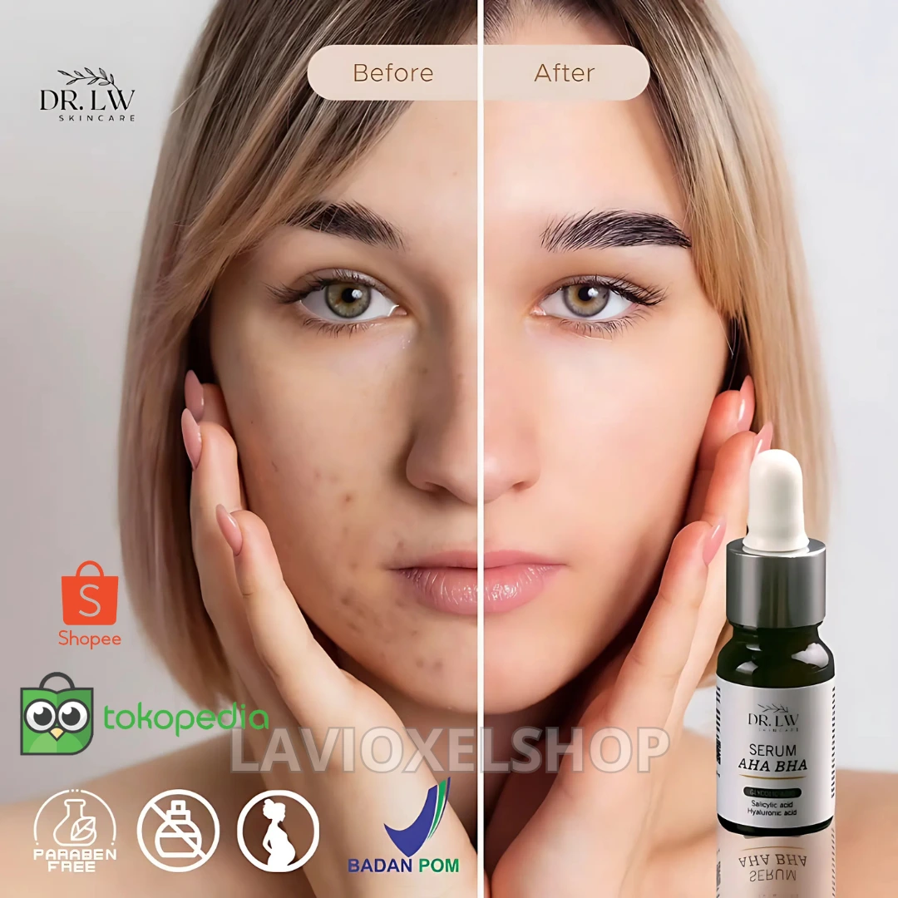

# Project Lavi



## Overview

Project Lavi is a Laravel-based web application for showcasing premium skincare products with modern UI components. The application features a Filament admin panel for content management, Livewire components for dynamic interfaces, and various JavaScript enhancements.

## Technology Stack

-   **Backend**: Laravel 11
-   **Frontend**:
    -   Tailwind CSS
    -   Alpine.js
    -   Livewire 3
-   **Admin Panel**: Filament v3
-   **JavaScript Libraries**:
    -   Chart.js for data visualization
    -   Markdown Editor for rich content editing
    -   Custom product slideshow

## Screenshots

<table>
  <tr>
    <td></td>
    <td></td>
  </tr>
  <tr>
    <td></td>
    <td></td>
  </tr>
</table>

## Features

-   **Dynamic Product Display**
    -   Interactive product slideshow
    -   Responsive product grid with filtering
    -   Detailed product pages
-   **User Experience**
    -   Performance optimizations with asset preloading
    -   Responsive design for all screen sizes
    -   Real-time interactions with Livewire
-   **Admin Panel**
    -   Content management via Filament
    -   User administration
    -   Analytics dashboard

## Installation

```bash
# Clone the repository
git clone https://github.com/yourusername/projectlavi.git
cd projectlavi

# Install PHP dependencies
composer install

# Install JavaScript dependencies
npm install

# Copy environment file and configure
cp .env.example .env
php artisan key:generate

# Configure database connection in .env file

# Run migrations
php artisan migrate

# Seed the database (optional)
php artisan db:seed

# Build assets
npm run build

# Start the development server
php artisan serve
```
